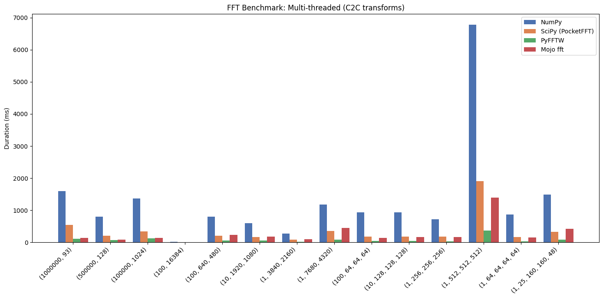
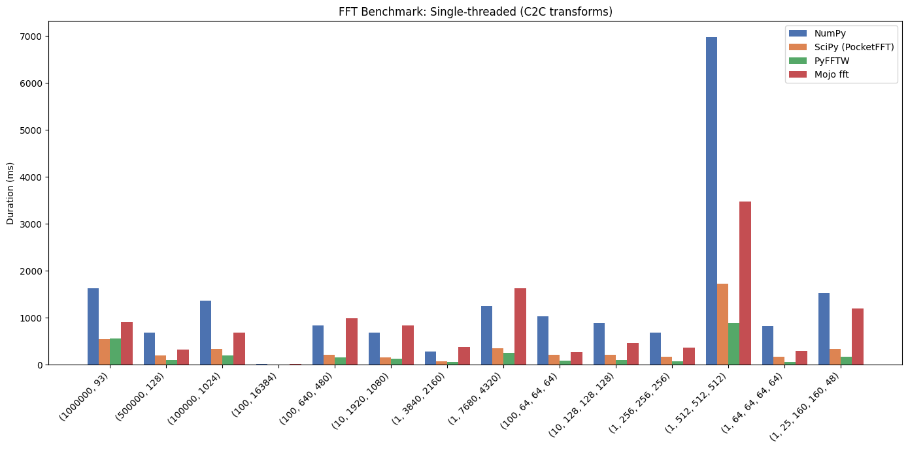

# An evolution of the Fast fourier transform for the Modular hackathon.

This is the improved and generalized version.

Less than 2000 lines of Mojo code, and yet it manages to compete against State
Of The Art implementations. This implementation is completely generic accross
N-dimensional ffts and portable accross accelerated devices that Mojo supports.
The code is also a perfectly generic implementation of radix-based fft
algorithms, it does not need a fallback for dimensions of uncommon prime
numbers, it can just use whatever prime the user selects (big radix bases take a
long while to compile though).

## GPU implementation on an RTX 5090 ( won through the original hackathon :D )

This implementation still doesn't use every trick in the book, so to me reaching
~70-100% of cufft's speed for 1D is already a huge achievement.
Multi-dimensional transforms seem to be around 2-5x slower than cufft.

C2C benchmnark results:

Shape (batch x dim) |  Mojo fft (ms) | cuFFT (ms)
--------------------|----------------|-----------
500k x 93           | 1.635          | 1.103
500k x 128          | 0.775          | 0.713
100k x 1024         | 1.432          | 1.113
100 x 640x480       | 1.670          | 0.713
100 x 64x64x64      | 2.043          | 0.433
10 x 128x128x128    | 1.670          | 0.354
1 x 256x256x256     | 1.394          | 0.566

## CPU implementation on an Intel i5-12600KF

Parity with PocketFFT was reached for multi-threaded workloads, the level of
CPU-specific optimization that FFTW can achieve is still to be matched with
better Mojo tools in the future.

### Multi-threaded (C2C transforms)



Shape                     | NumPy (ms)   | SciPy (PocketFFT) (ms)   | PyFFTW (ms)
--------------------------|--------------|--------------------------|-------------
(1000000, 93)             |     1591.307 |                  544.222 |      117.723
(500000, 128)             |      798.879 |                  205.622 |       68.319
(100000, 1024)            |     1363.857 |                  346.076 |      122.809
(100, 16384)              |       20.991 |                    5.141 |        1.739
(100, 640, 480)           |      800.118 |                  213.197 |       55.342
(10, 1920, 1080)          |      595.015 |                  165.391 |       59.838
(1, 3840, 2160)           |      277.847 |                   84.391 |       17.317
(1, 7680, 4320)           |     1178.133 |                  351.803 |       88.841
(100, 64, 64, 64)         |      934.896 |                  184.657 |       43.685
(10, 128, 128, 128)       |      936.118 |                  178.969 |       40.491
(1, 256, 256, 256)        |      713.664 |                  177.415 |       33.281
(1, 512, 512, 512)        |     6773.745 |                 1909.997 |      371.673
(1, 64, 64, 64, 64)       |      864.334 |                  165.608 |       36.918
(1, 25, 160, 160, 48)     |     1484.777 |                  328.983 |       81.976

This FFT implementation:

```terminal
bench_cpu_radix_n_rfft[(1000000, 93), workers=n]         | 145.392
bench_cpu_radix_n_rfft[(500000, 128), workers=n]         | 87.828
bench_cpu_radix_n_rfft[(100000, 1024), workers=n]        | 137.829
bench_cpu_radix_n_rfft[(100, 16384), workers=n]          | 5.077
bench_cpu_radix_n_rfft[(100, 640, 480), workers=n]       | 238.687
bench_cpu_radix_n_rfft[(10, 1920, 1080), workers=n]      | 183.980
bench_cpu_radix_n_rfft[(1, 3840, 2160), workers=n]       | 96.288
bench_cpu_radix_n_rfft[(1, 7680, 4320), workers=n]       | 452.927
bench_cpu_radix_n_rfft[(100, 64, 64, 64), workers=n]     | 142.284
bench_cpu_radix_n_rfft[(10, 128, 128, 128), workers=n]   | 171.060
bench_cpu_radix_n_rfft[(1, 256, 256, 256), workers=n]    | 162.653
bench_cpu_radix_n_rfft[(1, 512, 512, 512), workers=n]    | 1397.167
bench_cpu_radix_n_rfft[(1, 64, 64, 64, 64), workers=n]   | 149.500
bench_cpu_radix_n_rfft[(1, 25, 160, 160, 48), workers=n] | 422.915
```

### Single-threaded (C2C transforms)



Shape                     | NumPy (ms)   | SciPy (PocketFFT) (ms)   | PyFFTW (ms) 
--------------------------|--------------|--------------------------|-------------
(1000000, 93)             |     1636.036 |                  544.035 |      563.356
(500000, 128)             |      686.102 |                  199.044 |       97.819
(100000, 1024)            |     1364.555 |                  344.003 |      198.848
(100, 16384)              |       21.356 |                    4.818 |        3.408
(100, 640, 480)           |      832.563 |                  206.567 |      150.933
(10, 1920, 1080)          |      688.932 |                  163.169 |      129.134
(1, 3840, 2160)           |      280.429 |                   80.434 |       66.837
(1, 7680, 4320)           |     1261.457 |                  353.664 |      249.009
(100, 64, 64, 64)         |     1035.043 |                  207.037 |       86.646
(10, 128, 128, 128)       |      896.773 |                  207.300 |      100.809
(1, 256, 256, 256)        |      689.350 |                  166.118 |       81.148
(1, 512, 512, 512)        |     6971.338 |                 1724.812 |      890.657
(1, 64, 64, 64, 64)       |      822.744 |                  167.410 |       61.110
(1, 25, 160, 160, 48)     |     1528.222 |                  335.544 |      175.137

This FFT implementation:

```terminal
bench_cpu_radix_n_rfft[(1000000, 93), workers=1]         | 912.083
bench_cpu_radix_n_rfft[(500000, 128), workers=1]         | 329.169
bench_cpu_radix_n_rfft[(100000, 1024), workers=1]        | 685.075
bench_cpu_radix_n_rfft[(100, 16384), workers=1]          | 18.0374
bench_cpu_radix_n_rfft[(100, 640, 480), workers=1]       | 991.760
bench_cpu_radix_n_rfft[(10, 1920, 1080), workers=1]      | 841.108
bench_cpu_radix_n_rfft[(1, 3840, 2160), workers=1]       | 379.125
bench_cpu_radix_n_rfft[(1, 7680, 4320), workers=1]       | 1629.296
bench_cpu_radix_n_rfft[(100, 64, 64, 64), workers=1]     | 272.3020
bench_cpu_radix_n_rfft[(10, 128, 128, 128), workers=1]   | 462.275
bench_cpu_radix_n_rfft[(1, 256, 256, 256), workers=1]    | 367.672
bench_cpu_radix_n_rfft[(1, 512, 512, 512), workers=1]    | 3473.327
bench_cpu_radix_n_rfft[(1, 64, 64, 64, 64), workers=1]   | 299.650
bench_cpu_radix_n_rfft[(1, 25, 160, 160, 48), workers=1] | 1196.215
```

## Conclusions

It's been 9 months since the hackathon, this has been my nights and weekends
project for such a long time now that I think I could probably present this
as a thesis somewhere; I've literally dedicated more time to this than my
undergraduate thesis.